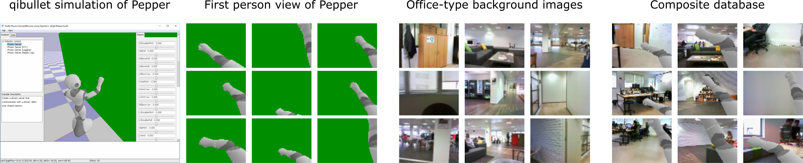
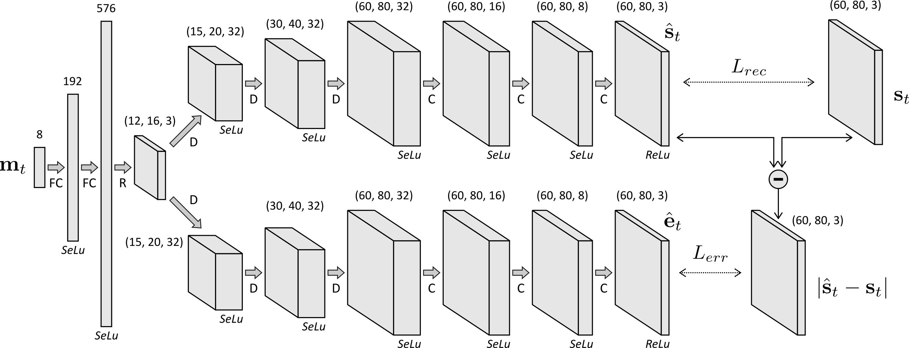
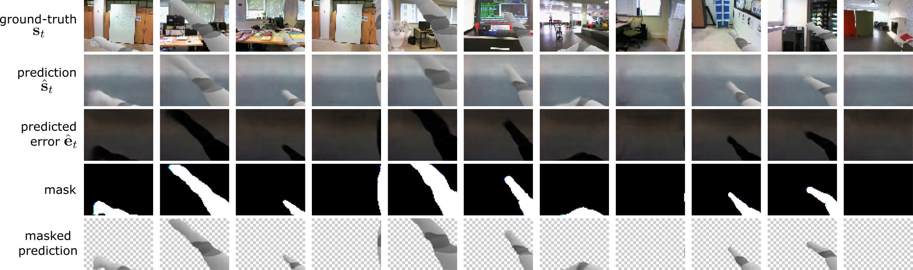
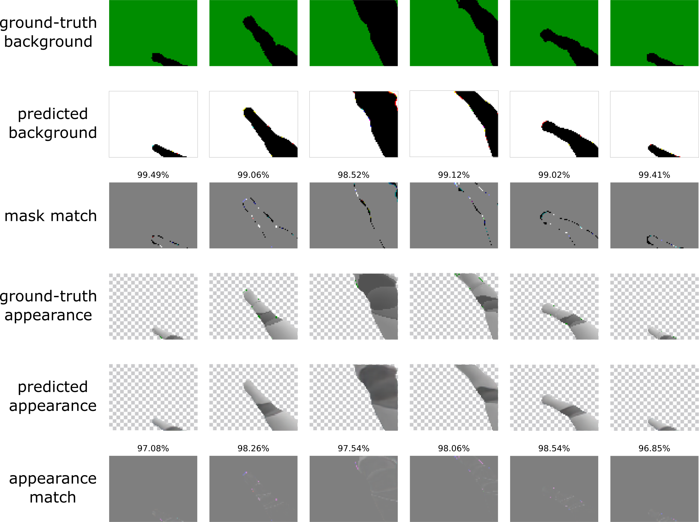
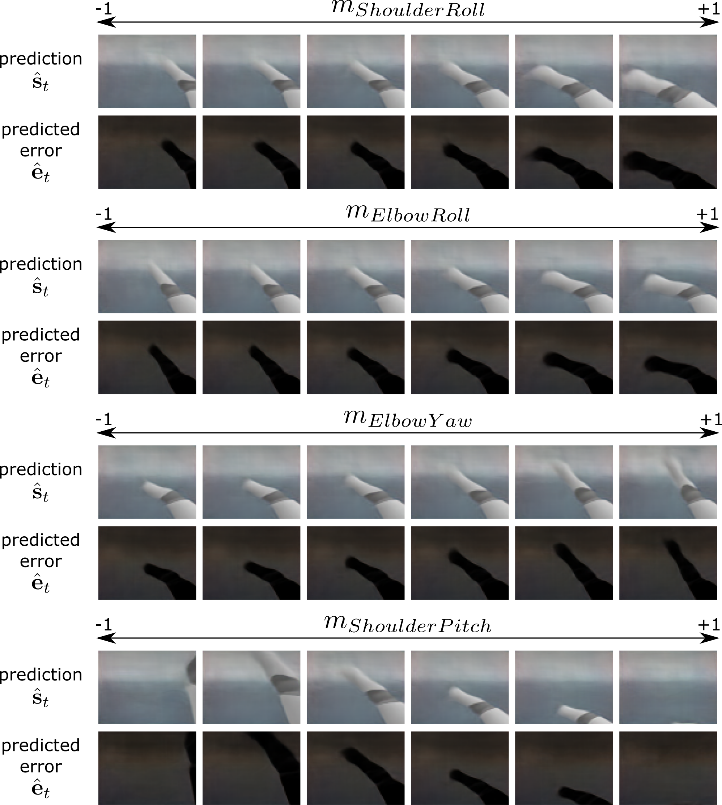

# Unsupervised Body Image Acquisition Using a Deep Neural Network for Sensorimotor Prediction

## Author and Contact
Alban Laflaquière (alaflaquiere@softbankrobotics.com)


## Introduction
This repository contains the code associated with the method described in the paper "Unsupervised Body Image Acquisition Using a Deep Neural Network for Sensorimotor Prediction" (Laflaquière and Hafner, 2019).

If you are using this implementation in your research, please consider giving credit by citing our paper:

    @inproceedings{laflaquiere2019bodyimage,
      title={Unsupervised Body Image Acquisition Using a Deep Neural Network for Sensorimotor Prediction},
      author={Laflaqui\`ere, Alban and Hafner, Verena},
      booktitle={9th Joint IEEE International Conference on Development and Learning and Epigenetic Robotics (ICDL-EpiRob)},
      year={2019},
      organization={IEEE}
    }

All scripts should be run using Python3.5.


## Files
* create_dataset.py: python3 script to generate a dataset of first-person views of a simulated Pepper robot's right arm moving in front of varying background images.
* learn_body_image.py: python3 script to train a deep neural network to predict a first-person view image and associated prediction error given an input motor configuration.
* test_network.py: python3 script to test the deep neural network.
* tools.py: collection of useful functions.


## Usage
  

  
To create a new dataset, put the png images that will be used as background in the folder "./dataset/background_dataset" and run the script create_dataset:

```
python create_dataset.py
```
It will create the dataset and save it in ".dataset/generated".

  

  
  
To train a network on the dataset, make sure that tensorflow is properly installed, and run the script learn_body_image:
```
python learn_body_image.py
```
It will save the optimized network in ".model/trained", along a visualization of the network progress in ".model/trained/progress".


## Model

A pre-trained model is provided in ".model/trained". To load and test it, use the following command:
```
python test_network.py
```



<br/><br/>



<br/><br/>



<br/><br/>

It will also create a video of a random exploration of the motor space and save it in ".temp/video".


## Advanced control

For a finer control of the simulation parameters
```
python create_dataset.py -n <number_images> -s <image_height> <image_width> -dd <dataset_destination_directory> -db <background_dataset_directory> -g <bool to save the intermediary images with a green background>
python learn_body_image.py -dd <dataset_directory> -dm <model_destination_directory> -n <number_epochs> -b <mini-batch_size> -nf <max_number_convolutional_filters>
python test_network.py -dm <model_directory> -dd <dataset_directory> -dg <datasetwith_green_background_directory> -dv <video_destination>
```
or check the scripts and the provided help:
```
python create_dataset.py --help
python learn_body_image.py --help
python test_network.py --help
```

